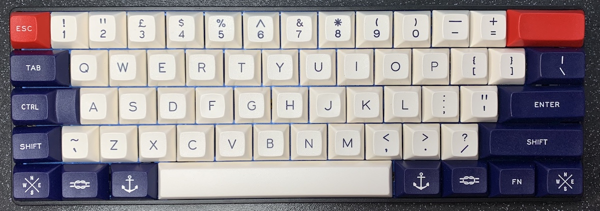

# Satan GH60 layout

This is a modified ANSI layout which splits the left shift and adds a grave
key. That's really it!

To do that, I had to tweak the layout because it was configured to ignore the
code from the pad immediately to the right of the left shift. That's why this
layout has a `satan.h`.

## Show me

## Why?

I like 60% keyboards, but I also like to be able to type tildes and backticks.
Since the GH60 Satan PCB I bought had the space to add a key to the right of
the left shift, I did it. Why haven't I split the right keys? I don't know :D

## How?

 1. Check this repo out into `keyboards/gh60/satan/keymaps/` in a clone of the
[QMK firmware repo](https://github.com/qmk/qmk_firmware/).
 2. Run `make git-submodule`
 3. Run `make gh60/satan:mattfoster:flash`

